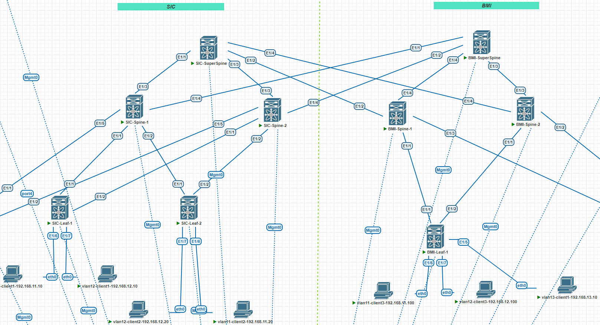

# Ansible Project Structure
This project is structured to manage data center fabric infrastructure using Ansible, organized with inventories, group variables, host-specific configurations, and playbooks to configure different sets of devices such as leafs, spines, and superspines.

## Project Structure
```bash
├── ansible.cfg
├── inventories
│   ├── group_vars
│   │   ├── all.yaml
│   │   ├── bmi_leafs.yaml
│   │   ├── bmi_spines.yaml
│   │   ├── bmi.yaml
│   │   ├── border_leafs.yaml
│   │   ├── leafs.yaml
│   │   ├── sic_leafs.yaml
│   │   ├── sic_spines.yaml
│   │   ├── sic.yaml
│   │   ├── spines.yaml
│   │   └── superspines.yaml
│   ├── hosts
│   └── host_vars
│       ├── bmi_BL.yaml
│       ├── bmi_leaf1.yaml
│       ├── bmi_spine1.yaml
│       ├── bmi_spine2.yaml
│       ├── bmi_superspine.yaml
│       ├── sic_BL.yaml
│       ├── sic_leaf1.yaml
│       ├── sic_leaf2.yaml
│       ├── sic_spine1.yaml
│       ├── sic_spine2.yaml
│       └── sic_superspine.yaml
└── playbooks
    ├── leafs.yaml
    ├── spine.yaml
    └── superspine.yaml
```

## Cloning the Project
To get started with this project, follow the steps below to clone the repository and set it up locally.

### Prerequisites
- Ensure that you have [Git](https://git-scm.com/book/en/v2/Getting-Started-Installing-Git) and [Ansible](https://docs.ansible.com/ansible/latest/installation_guide/intro_installation.html) installed on your machine.
- Optionally, make sure Python and a virtual environment tool (e.g., `venv`, `virtualenv`) are set up to isolate your Ansible dependencies.

### Steps to Clone
1. **Clone the Repository**

Open your terminal and run the following command to clone the project repository:
```bash
   git clone <repository_url>
```

2. **Navigate to the Project Directory**

Once the repository is cloned, navigate into the project directory:
```bash
cd <project-directory>
```

3. **Set Up a Virtual Environment (Optional)**

If you want to use a virtual environment to manage dependencies, create and activate it:
```bash
python3 -m venv venv
source venv/bin/activate
```

4. **Install Required Dependencies (if any)**

If there are any Python dependencies needed for the project (e.g., custom modules or scripts), install them:
```bash
pip install -r requirements.txt
```

5. **Run Ansible Playbooks**

Ensure you are in the project root directory and then run the desired playbooks. For example:
```bash
ansible-playbook -i inventories/hosts playbooks/leafs.yaml
```

## Files and Directories

### `ansible.cfg`
Configuration file for Ansible behavior such as:
- Inventory paths
- SSH connection settings
- Retries and timeouts
- Any other custom configurations

### `inventories`
Contains the inventory files and variables definitions for the managed hosts.

#### `group_vars/`
Stores variables that are applied to groups of hosts.

- `all.yaml`: Variables shared across all hosts.
- `bmi_leafs.yaml`: Variables specific to BMI leaf switches.
- `bmi_spines.yaml`: Variables specific to BMI spine switches.
- Other YAML files (e.g., `sic_leafs.yaml`, `spines.yaml`) define group-specific variables for other layers like SIC leafs and spines.

#### `hosts`
This is the main inventory file where all the managed hosts are listed and grouped. It defines the organization of devices into groups like leafs, spines, etc.

#### `host_vars/`
Contains variables that are specific to individual hosts.

- `bmi_BL.yaml`: Variables specific to the BMI border leaf.
- `sic_leaf1.yaml`: Variables specific to the SIC leaf1.
- `bmi_spine1.yaml`, `sic_spine1.yaml`, etc.: Files that define host-specific variables for individual BMI and SIC switches (e.g., spines, leafs).

### `playbooks`

This directory contains the Ansible playbooks used to configure different network devices.
- `leafs.yaml`: Playbook for configuring leaf switches.
- `spine.yaml`: Playbook for configuring spine switches.
- `superspine.yaml`: Playbook for configuring superspine switches.

## Lab Diagram
